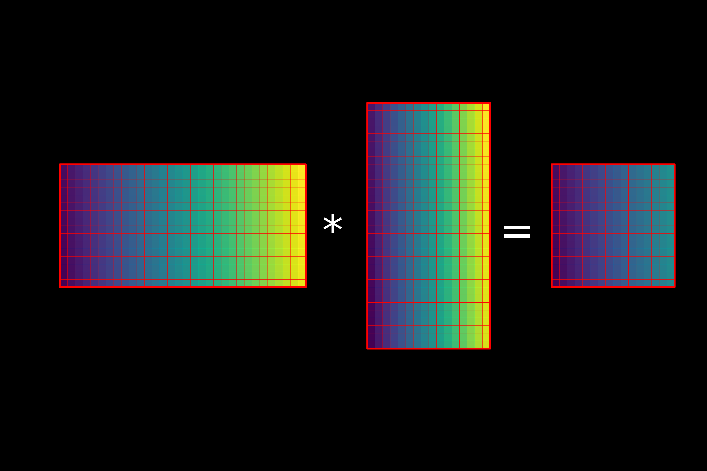
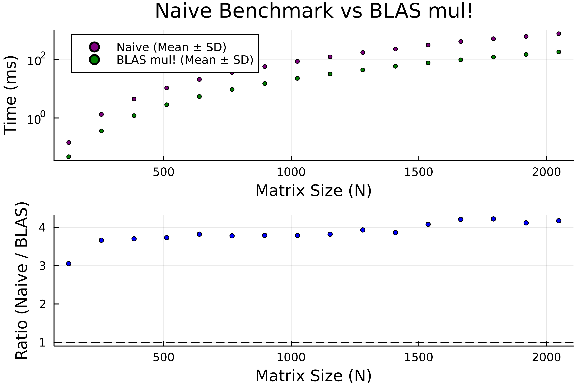
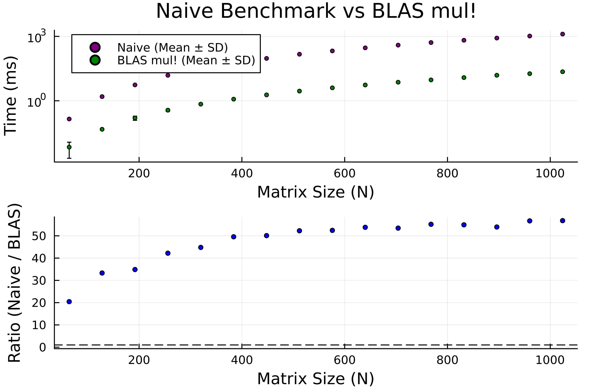
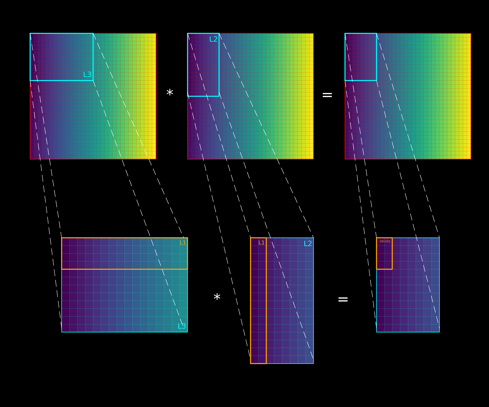
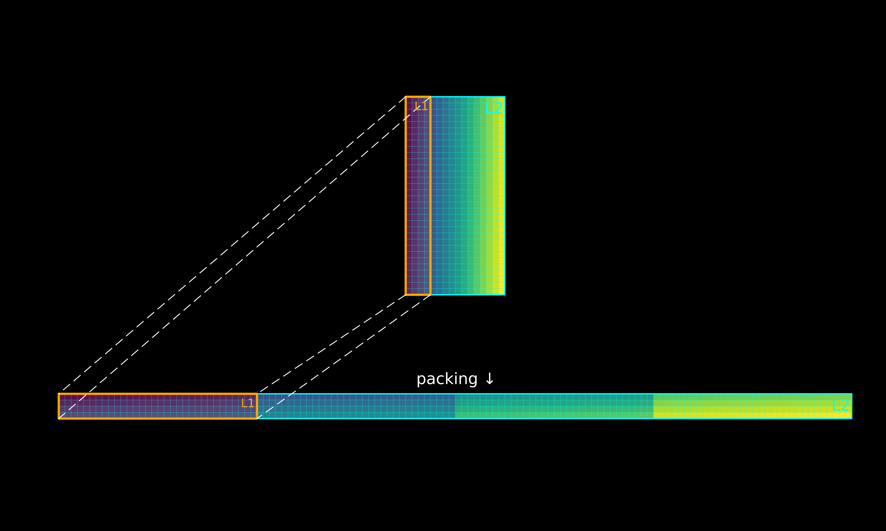
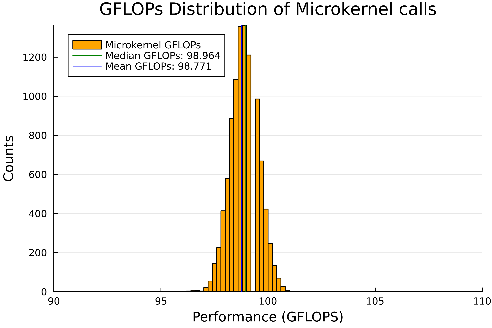
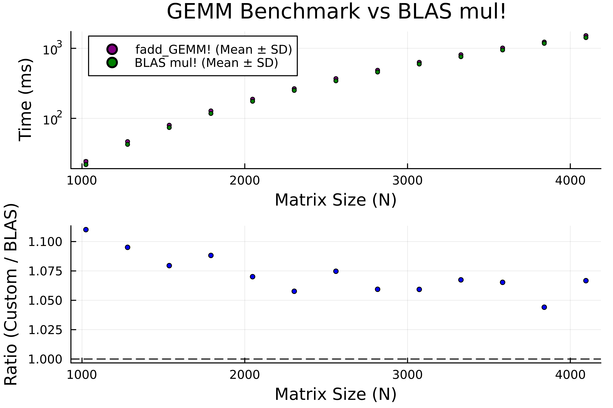

# GEMM-workbench
Implementing a cache-aware, partially generic GEMM in Julia

## Disclaimer

The benchmarks and hyperparameter tuning was performed on an M1 Pro. The microkernel design makes use of certain ARM-specific NEON SIMD intrinsics implicitly: however we will discuss non-ARM alternatives. 

The high-level implementation used here is largely based on the following [BLIS paper](https://link.springer.com/article/10.1007/s11227-022-05003-3): the microkernel is backend agnostic and is making use of the LLVM-level **SIMD.jl** package and code generation. The GEMM presented is strictly single-thread but we will discuss potential paralelization techniques.

We only show an FP32 implementation, however the generated nature of the microkenerl makes it trivial to generalize to higher (or lower) precisions.

## Matrix Multiplication

It would be not a great exagaration to claim that matrix multiplication is one of the most important parts of modern computing: from solving linear problems, to linear programming, regression, modern machine learning models, graphics and even graph theory, it dominates both technical and non-technial computing and powers large parts of our modern infrastructure. 

General matrix multiplication (GEMM) thus tends to be one of the most optimized pieces of code ever written, with microkernels typically written in assembly directly. They typically push the theoretical maximum FLOPs (floating point operations per second) of hardware by carefully hiding latency and managing the cache-flow of the involved memory. This makes these implementations, as we will see, dozens of times faster than naive "triple loop" solutions.

## Cache 101

Virtually all modern hardware makes use of a **cache hierarchy**: that is, between RAM and the CPU registers (which can actually modify data) we have multiple layer (typically called L3-L1) **caches** which are faster to access by the CPU than RAM. Cache that is closer to the CPU is smaller in size (typically ~32-128 kB) but is extremely fast to access: cache "further out" is slower to access but holds much more data.

The way and how data is cached is dictated by two things: these are typically called **temporal** and **spatial locality**. 

Whenever the CPU requests data from memory, its also grabs the surronding 64-byte strip called a **cache line**, i.e. we anticpiate that data that is close in memory will be used again soon: hence the **spatial** part. If we use data that efficently by understanding the underlying memory layout, we can make use of this effect and use this close-by-data which is already bough to the fast-access cache.

Since caches have small memory sizes, the CPU usually relies on a heuretic like least-recently-used (LRU) selection to remove "old" data from the cache and make space for new one. Good usage of **temporal locality** means that we keep data "hot" in cache, and keep reusing it as long as possible, before it being evicted by the CPU, i.e. we effectively stop needless reloads from RAM.

## Memory layout 101

All memory is one-dimensional and discrete. Higher dimensional objects, like matrices, N-D arrays, map into the underlying 1-D memory through space-filling curves. Due to historical reasons (mainly because of the differing conventions used by C and Fortran), two main ways of such emerged: **Column major** (Fortan, Julia) and **row major** (C-languages, Numpy), called as such for which dimension is continious in a matrix (rows or columns). For instance, for a matrix multiplication, we can visualize the linear memory indeces in Julia as seen bellow.

## Naive approaches and where they fail

The often cited (and for small matrices, not too bad!) implementation to compute $C_{ij} = A_{ik}B_{kj}$ relies on maximizing **spatial locality** to try to achieve high performance. In Julia, this means a loop order of j-k-i (outermost loop is j).

The following figure shows the result of this implementaion compared to BLAS. 

While this implementation exploits spacial locality, it completely neglects temporal locality. As the size of the involved matrices grow, less and less of them will fit into the inner caches. The j-k-i order means that, due to the LRU nature of the cache system, we are constantly trashing elements of matrix A (which were not used recently) and we need to reload it from slower cache layers! This is visible on the plot - the ratio to BLAS speed is roughtly constant on two intervals, and ju,ps once it hits the limit of the L2 and L3 cache, which cause trashing into the L3 and RAM respectively.

A naive solution to this would be to ignore spatial locality altogether and go for greatly increased **temporal locality**. This is achieved via an j-i-k order, which is optimal for the spatial locality of C and A, but trashes spatial access for B. 

As it turns out, this is a horrible idea. Modern CPUs are also eqipped with some tools to mitigate inefficient spatial and temporal access patterns, but it is simply not enough to neglect the inefficient access for B (also, makes it harder for the compiler to apply SIMD intrinsics)

For these implementations, see the scripts `naive_spat_loc_vs_blas.jl` and `naive_temp_loc_vs_blas.jl` scripts.

## Anatomy of a high-performance GEMM

A high perfomance matrix-multiplication algorithm relies on a mixture of three factors - these are **tiling**, **packing** and **microkernel design**. In effect, it aims to keep the CPU constantly occupied, and to minimize cache latency to feed the CPU, therefore maximizing FLOPs.

**Tiling**, blocking or residency management referes to a technique where instead of iterating A and B element-by-element, we instead go over them by larger sub-matrices called **tiles**. By basically subdividing the original "hot" loops, we can keep each tile in memory longer, increasing **temporal locality** and somewhat **spatial locality**.

On a more detailed level, their size is typically chosen they will fit into a particular cache, i.e. greatly increasing temporal locality. Typically this means that one of the sub-matrices is made resident so that fits into the L3 cache and the other is sized so that it fits into ~half of the L2 cache (to allow the L3-resident to "stream through" L2 unimpended). Since these tiles are explicitly copied when we pack them (discussed in the next section why), we want to copy the larger (L3 resident) less, and the L2 resident more often, to amortize their cost over the subsequent, inner loops. This means that the loop order should be chosen so that the outer two loops loop over the indeces of the L3-resident matrix, and the inner two loops should be looping over the L2-resident matrix's indeces. Since these loops cover large sub-matrices, and are carried out only a few times, their order with respect to temporal or spatial locality is ammortized anyway - this gives us relatively great freedom in which matrix to make resident and where.

In the implemention found in `src/GEMM.jl`, we chose a macro-loop order that packs $A$ sub-matrix at the L3 level, and $B$ tile to ~half of the L2 capacity. (i-k-j macro loop order, from outermost to innermost). This choice is somewhat arbitrary - we can change the loop order and thus the tiling strategy, and due to being ammortized, its not likely to change the benchmark results too much.

The strategy is illustrated bellow:

**Packing** refers to a technique where we re-order the copied sub-matrices so that they become "more continious" for the **microkernel** to operate on. This typically means that for **both** matrices, we want to create two stripes (such stripes have the entire k-length of the buffer, but very small i/j sizes, as dictated by the **microkernel** design's dimension, which we should call `I, J`), which, when combined in size, fit into the L1 cache and have continious access patterns for a **fixed** k, i.e. say the elements of `B[k, j], B[k, j+1], B[k, j+2]...` are now continious in memory (for A also, but for column-major layout makes it easier to copy it into a continious buffer). This means that packing the non-continious buffer - B - involves an implicit step transposing step, but by carefully traversing the array in L1-shaped blocks, the lack of spatial locality is largely minimized. 

For B, the packing step is illustarted bellow. The resulting matrix is `(J, K_long = K_macro * div(J_macro, J))` sbaped (i.e. we have continioity in the columns) and this matrix is only allocated once and overewritten each packing step (ammortizing the allocation's cost).

The **microkernel** is the bread and butter of a GEMM. All the previous steps had been carried out to make life easier for the microkernel - and since we will be spending >99% of teh execution time in there, it is paramount it is pushing the hardware's limit. Microkernels, by definition, need to reduced every single possible overhead and relly on hardware acceleration features, like SIMD instructions and fused-multiply-add (FMA) accumulators. Most microkernel work by having the outer, k loop (**K_long**) being unrolled by some factor (2-8, typically) to reduced loop overhead and allow the compiler to better pipeline exection, while a fixed number of the matrix C (the accumulators) are kept in registers (i.e. a `I x J` block) and for each K, we perform an outer product between the elements of A and B, which are at this point also loaded into SIMD registers. This innermost loop over the I and J registers is fully unrolled to reduced overhead and allow the compiler to further pipeline instructions.

Our microkernel is made using Julia's `generated` function together with `SIMD.jl` to map into the underlying SIMD instructions. We are making use of ARM Neon's by-lane SIMD instructions, which allows us to choose one of the source terms in an FMA instruction as a scalar indexed into a SIMD register. ([see](https://developer.arm.com/documentation/ddi0602/2022-06/SIMD-FP-Instructions/FMLA--by-element---Floating-point-fused-Multiply-Add-to-accumulator--by-element--)). This is in contrast to x86 arch' where we typically instead load and broadcast a single element of B into a SIMD register and perform FMA with this "uniform" register instead - thus in effect, on ARM we have a marginally easier case of loading the elements of B, whereas on a x86 arch we would need to first broadcast. 

The microkernel has a number of hyperparameters, which are already optimized in this implemention. These are the tile size of the accumulators in matrix `C` (the microkenrel dimensions), the length of unrolling the K-loop (kept low so that the instruction cache is not suffocated) and optional "spilling" parameters which might help on more exotic architectures (they essentially allocate more registers for accumulating into C then `I x J` by a factor of `accum_spill`, allowing the long FMA dependency chains to be broken up: this is useful if the chosen microkernel size is so small that the FPUs would be sitting idle). We typically want to chose microkernel dimensions so that the registers needed to hold the the C-accumulators and the current columns/stripes of A and B needed to perform the outer product all fit into registers (keep in mind that a simple register can hold `width/32` FP32s, so for a `16x4` microkernel on ARM for instance we need only 16 accumulator registers and some that load and store data from the A and B tile.)

When the microkernel finishes the current accumulatoion (having finished the L1-cache sized stripe), the accumulators are added back into memory, minimizing the number of memory accesses touching C.

We can compare the performance of the microkernel generated to the maximum possible single-core GFLOPs of our hardware - for an M1 Pro and FP32s, this is around ~103-104 GFLOPs.

As we can see, our microkernel has a mean/median GFLOPs of around ~99 GFLOPs, which is very good, suggesting almost perfect assembly generation and pipelining (`@code_native` confirms the former). All that remains now is to choose the microkernel dimensions based on a mixture of benchmarking the whole GEMM (larger tile sizes reduced loop overhead at the micro-tile level) and by napkin-math (i.e. keeping a reasonable number of C accumulators, and keeping the microkernel longer in the dimension that corresponds to a conditinious read (columns, i.e. `I`)). All that remains now is to benchmark the final product!

## The results 

Our final implemention is within 4-8% of the OPENBLAS `mul!()` calls for sufficiently large (matrices that are around, or larger than, the L2 cache). This makes it fairly performant, proving that the overall strategy chosen is overall sound, all while not using any very-low level tricks that are present in other languages (i.e. explicit assembly in the microkernel) and remaining flexible (the microkernel is not hardcoded, but generated "on demand").

## Limitations and ideas for improvement

The current implementation prsented here suffers from a number of limitations, most of which is easily fixable.

First of all, a true GEMM should be able to handle FP64 and transposed inputs as well. FP64s can be implemented easily - we can expect good performance by just switching to a `(8x4)` microkernel, but for transposed inputs, the packing logic would need to be modified - due to Julia's multiple dispatch this should be easy enough!

The second is that we currently enforce that the matrix dimensions must be integer multiples of the microkernel dimensions. To fix this, we would need to accomodate the leftover tiles in the packing function, "zeroing" out the leftover portions to get the correct results from the microkernel (sometimes called "padding" even though we are not allocating extra memory, just keeping the lower rows of the microkernel "stripes" zeroed out on those cases).

The third is relatively simple - we have currently determined the ideal hyperparameters, like macro-tile sizes and microkernel dimensions by benchmarking and analytical modelling, but we could at least partially generalize these as a function of known parameters, like cache sizes, vector register counts and widths, and number of FPUs, as a good starting set of parameters for any arch.

The fourth is dealing with smaller matrices (<1024). Some of the techniques used, like packing or macro-tiling, is simply more trouble than worth for smaller matrcies, as all three matrices can fit comfortably into the L2 or even L1 cache, which causes visible degradation in the performance in the above plot. For extremely small (<20) matrices, it might even be worth to "fully unroll" the naive matrix multiplicaion. All of these ideas can be implemented as runtime specializations in the overall function and might be ground for a new project.

The fifth, and last, is parallelization: currently, our code is strictly single-threaded. Optimizing parallel, BLAS like code is a whole another beast, but a good starting point would be to parallelize the macro-loops, specifically the `i` or `j` loops to avoid data races.

